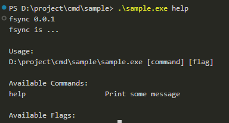
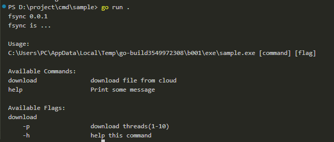

# Overview

Cmd is a simple cmd tool for golang

# Installing

Using cmd is easy.

```go
import "github.com/zhanxiaox/cmd"
```

```bash
go mod tidy
```

# Usage

First import package

```go
import "github.com/zhanxiaox/cmd"
```

Create a app

```go
app := cmd.New()
```

Add a command

```go
app.AddCommand(cmd.Command{
	// command name
	Name:"help",

	// command description
	Desc:"Print some message",

	// command ...
	Excute:func(this cmd.Command) error{
		// this is default help for app
		// or you can do some other staff
		return app.DefaultHelp();
	}
})
```

It willbe like this  


Or you can add more complete

```go
app.AddCommand(cmd.Command{
		// command name
		Name: "download",

		// command description
		Desc: "download file from cloud",

		// command flag like: app download -p 100
		// -p is flags
		// when flag has excute,it will be use it,not use command.Excute
		// in excute,you can get command infomention
		Flags: map[string]cmd.Flag{
			"-p": {Name: "process", Usage: "download threads(1-10)"},
			"-h": {Name: "help", Usage: "help this command", Excute: func(this cmd.Command) error {
				return this.DefaultHelp()
			}},
		},

		// command ...
		Excute: func(this cmd.Command) error {
			p, err := this.MustGetFlagInt64("-p")
			if err != nil {
				return err
			}
			app.Info("start download files with " + fmt.Sprint(p) + " threads")
			return nil
		},)
```

It will be like this  


More usage in sample

# License
